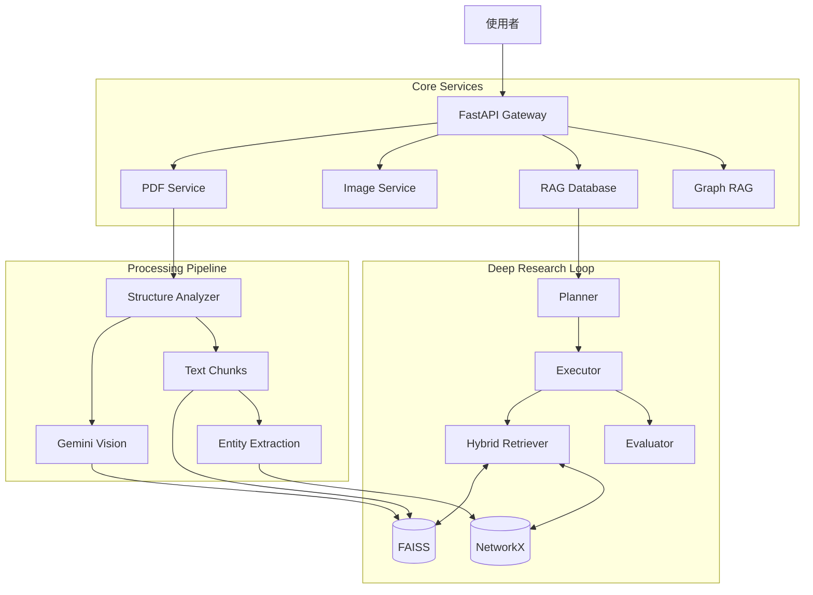

# Multimodal Agentic RAG System 🧠📚

> **A Next-Generation Academic Research Assistant**
> 基於代理人 (Agentic) 架構、具備自我修正與多模態理解能力的深度研究系統。

## 📘 Documentation Entry

- Primary docs entry: `docs/index.md`
- Legacy conductor docs: `conductor/`


## 🌟 專案願景 (Vision)

本系統旨在解決傳統 RAG (Retrieval-Augmented Generation) 在學術研究場景中的三大痛點：

1.  **碎片化 (Fragmentation)**：缺乏全域視角，難以處理跨文檔邏輯。
2.  **幻覺與和稀泥 (Averaging Hallucination)**：面對觀點衝突的文獻時傾向於取平均值，忽略反駁證據。
3.  **視覺盲區 (Visual Blindness)**：無法精確理解論文中的圖表數據。

透過引入 **Agentic Workflow** (Planner, Executor, Evaluator, Synthesizer) 與 **GraphRAG**，本系統能像人類研究員一樣進行「規劃 -> 執行 -> 評估 -> 修正」的深度研究循環。

---

## 📚 系統模組與技術文檔 (System Modules)

本專案由 7 個核心模組組成，每個模組皆有獨立的技術文件：

| 模組名稱 | 職責 | 技術文件連結 |
| :--- | :--- | :--- |
| **PDF Service** | PDF 上傳、OCR、翻譯與重製 | [📖 PDF Service Guide](checklist/pdfservice_md_guide.md) |
| **RAG Database** | 向量儲存、語意檢索與 Deep Research 邏輯 | [📖 RAG Database Guide](checklist/database_guide.md) |
| **Image Service** | 圖片內的文字翻譯 (In-Place Translation) | [📖 Image Service Guide](checklist/image_service_guide.md) |
| **Multimodal RAG** | 圖表提取、視覺摘要與多模態索引 | [📖 Multimodal RAG Guide](checklist/multimodal_rag_guide.md) |
| **Graph RAG** | 知識圖譜構建、實體抽取與全域搜尋 | [📖 Graph RAG Guide](checklist/graph_rag_guide.md) |
| **Statistics** | 用戶儀表板數據統計 | [📖 Statistics Guide](checklist/stats_guide.md) |
| **Conversations** | 對話歷史管理與訊息儲存 | [📖 Conversations Guide](checklist/conversations_guide.md) |

---

## 🔥 核心功能 (Core Features)

### 1. 🔬 Deep Research (深度研究代理人)
- **Plan-and-Solve 架構**: 自動將複雜問題拆解為子任務。
- **Adaptive Loop (動態修正)**: 執行後自動調用 Evaluator 評分，若品質不佳自動重試。
- **Conflict Arbitration**: 識別證據權重（Benchmark > Single Paper），避免和稀泥。

### 2. ⚖️ Academic Evaluation Engine (學術評估引擎)
- **1-10 分制多維度評分**: Accuracy, Completeness, Clarity.
- **Pure LLM 對照**: 支援與無 RAG 的原生 LLM 進行 A/B Testing。

### 3. 🕸️ GraphRAG (知識圖譜增強)
- **全域視角**: 利用 NetworkX 構建實體關係圖。
- **Hybrid Search**: 結合 Vector Search + Graph Traversal。

### 4. 👁️ Multimodal Understanding (多模態)
- **Gemini Vision**: 自動摘要圖表。
- **Deep Image Verification**: 針對特定圖表數據進行二次深度查證。

### 5. 🌍 Advanced Translation (學術翻譯)
- **Layout-Aware**: 保持 PDF 原始排版 (Pandoc 重建)。

---

## 🚀 快速開始 (Quick Start)

### 1. 前置要求
- Python 3.10+
- Google Gemini API Key
- Supabase Project (用於 Auth 與 Logging)
- Datalab API Key (用於 PDF 結構分析)

### 2. 建立虛擬環境 (Virtual Environment)
**⚠️ 本專案必須在虛擬環境中執行以確保依賴隔離。**

```bash
# Windows
python -m venv .venv
.venv\Scripts\activate

# Linux/Mac
python3 -m venv .venv
source .venv/bin/activate
```

### 3. 安裝依賴
```bash
pip install -r requirements.txt
```

### 4. 設定環境變數
複製 `config.env.example` 為 `config.env` 並填入：
```env
GOOGLE_API_KEY=your_key
SUPABASE_URL=your_url
SUPABASE_KEY=your_key
DATALAB_API_KEY=your_key
HF_TOKEN=your_huggingface_token
```

測試與 CI 建議：
```env
TEST_MODE=true
USE_FAKE_PROVIDERS=true
CI_BLOCK_EXTERNAL_NETWORK=true
```
上述模式會啟用 fake providers 並封鎖測試中的外部連線，避免誤呼叫真實 LLM / Datalab API。
正式使用時請改為 `TEST_MODE=false`、`USE_FAKE_PROVIDERS=false`（`CI_BLOCK_EXTERNAL_NETWORK` 只在測試/CI 開啟）。

### 5. 啟動服務
```bash
uvicorn main:app --reload
```
API 文件: `http://localhost:8000/docs`

---

## 🛠️ 系統架構 (Architecture)



---

## 📅 開發進度 (Roadmap)

- [x] **Phase 1-3**: 基礎 RAG 與 Agent 架構
- [x] **Phase 4-6**: 評估引擎與深度研究優化
- [x] **Phase 7-9**: 多模態整合 (OCR, Vision, Re-Act)
- [x] **Refactor (2026/01)**: 系統模組化與文檔重構 (Current)
- [ ] **Phase 10**: ColPali 視覺向量嵌入 (Next Step)

---

## 📄 License

MIT License
