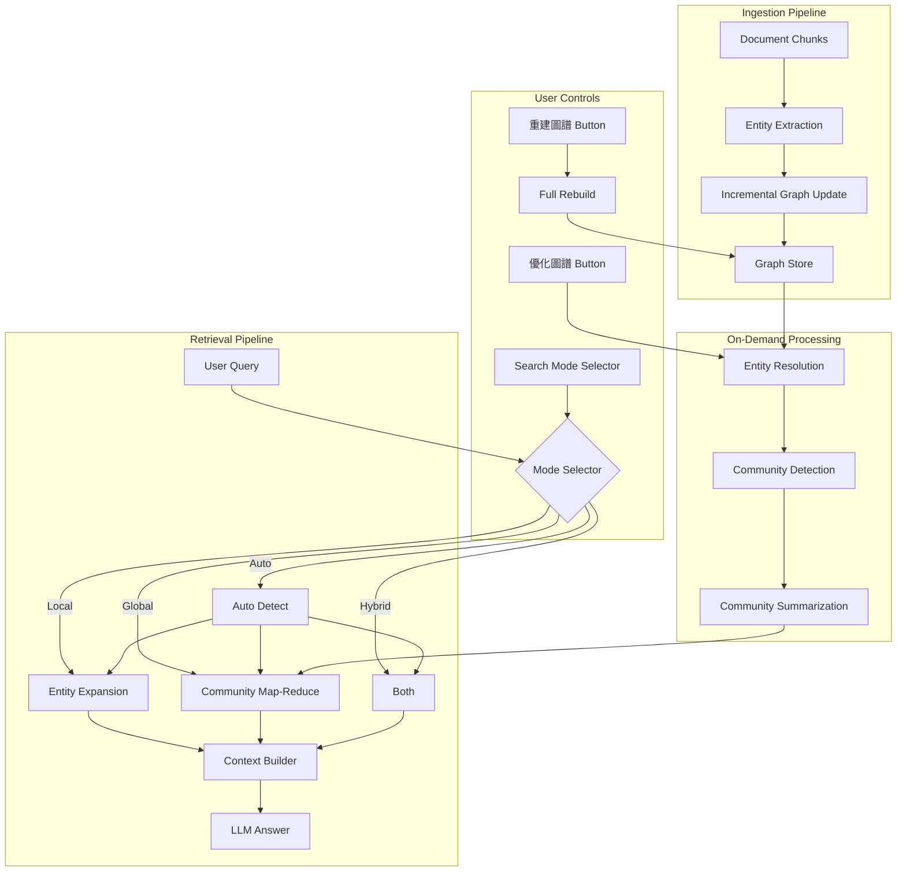
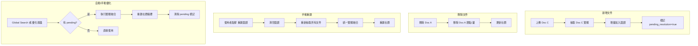

# Phase 5: GraphRAG 實作計畫書 (GraphRAG Implementation Plan)

> **目標**: 為多論文 (Multi-Paper) 研究與深度分析 (Deep Research) 構建知識圖譜增強檢索系統
> **日期**: 2025-12-21
> **狀態**: ✅ 設計確認完成 (Ready for Implementation)

---

## 0. 設計決策總覽 (All Decisions Confirmed)

| 項目             | 決策                | 使用者控制         |
| :--------------- | :------------------ | :----------------- |
| **Token 成本**   | ✅ 可接受           | -                  |
| **抽取模型**     | `gemini-3.0-flash`  | LLM Factory 可配置 |
| **圖譜範圍**     | Per-user 獨立圖譜   | -                  |
| **社群演算法**   | Leiden (準確度優先) | -                  |
| **更新策略**     | 混合方案 (Hybrid)   | 手動重建按鈕       |
| **搜尋模式**     | Auto 為預設         | 使用者可選擇       |
| **實體融合**     | 自動觸發            | 手動觸發開關       |
| **Planner 整合** | 可配置              | Web 設定頁開關     |

---

## 1. 執行摘要 (Executive Summary)

目前的系統使用標準 RAG (Vector + Keyword)，在回答具體事實問題時表現優異。然而，當使用者進行「多論文研究」時，傳統 RAG 容易破碎化，缺乏全域視角。

本計畫引入 **GraphRAG**，通過提取實體與關係構建知識圖譜，實現：

1. **全域搜尋 (Global Search)**: 摘要跨文檔的巨觀主題
2. **關聯推理 (Relational Reasoning)**: 發現文檔間隱含的連結
3. **增強深度研究**: 為 Plan-and-Solve Agent 提供結構化知識支持

---

## 2. 架構設計 (Architecture Design)

### 2.1 系統架構圖



### 2.2 技術選型

| 組件           | 技術               | 配置                                    |
| :------------- | :----------------- | :-------------------------------------- |
| **圖譜存儲**   | NetworkX + Pickle  | `uploads/{user_id}/rag_index/graph.pkl` |
| **抽取 LLM**   | `gemini-3.0-flash` | `llm_factory: "graph_extraction"`       |
| **摘要 LLM**   | `gemini-3.0-flash` | `llm_factory: "community_summary"`      |
| **回答 LLM**   | `gemma-3-27b-it`   | `llm_factory: "rag_qa"`                 |
| **社群演算法** | Leiden             | `leidenalg` + `python-igraph`           |

### 2.3 檔案結構

```
graph_rag/                     # 新增頂層模組
├── __init__.py
├── schemas.py                 # Node, Edge, Community, GraphDocument
├── store.py                   # NetworkX 封裝 + 序列化
├── extractor.py               # LLM 實體/關係抽取
├── entity_resolver.py         # 實體融合 (embedding-based)
├── community_builder.py       # Leiden + 社群摘要
├── local_search.py            # Entity Expansion
├── global_search.py           # Community Map-Reduce
└── router.py                  # 新增: /graph/* API 端點

data_base/
├── router.py                  # 修改: AskRequest 新增 graph 參數
├── RAG_QA_service.py          # 修改: 整合 graph retriever
├── vector_store_manager.py    # 修改: 刪除時同步清理圖譜
└── schemas.py                 # 修改: 新增 Graph 相關 schemas

agents/
└── planner.py                 # 修改: 支援 graph_analysis 子任務

core/
└── llm_factory.py             # 修改: 新增 graph_extraction, community_summary
```

---

## 3. API 設計 (API Design)

### 3.1 新增 Graph 管理端點

| 端點              | 方法 | 說明         | 使用者控制       |
| :---------------- | :--- | :----------- | :--------------- |
| `/graph/status`   | GET  | 取得圖譜狀態 | 顯示在 UI        |
| `/graph/rebuild`  | POST | 強制重建圖譜 | 「重建圖譜」按鈕 |
| `/graph/optimize` | POST | 執行實體融合 | 「優化圖譜」按鈕 |

#### GET /graph/status Response

```json
{
  "has_graph": true,
  "node_count": 1250,
  "edge_count": 3400,
  "community_count": 12,
  "pending_resolution": 45,
  "needs_optimization": true,
  "last_updated": "2025-12-21T10:30:00Z"
}
```

#### POST /graph/rebuild Request

```json
{
  "force": false
}
```

### 3.2 修改 AskRequest Schema

```python
class AskRequest(BaseModel):
    # === 原有欄位 ===
    question: str
    doc_ids: Optional[List[str]] = None
    history: Optional[List[ChatMessage]] = None
    enable_hyde: bool = False
    enable_multi_query: bool = False
    enable_reranking: bool = True
    enable_evaluation: bool = False

    # === 新增 GraphRAG 欄位 ===
    enable_graph_rag: bool = Field(
        default=False,
        description="啟用知識圖譜增強檢索"
    )
    graph_search_mode: Literal["local", "global", "hybrid", "auto"] = Field(
        default="auto",
        description="圖譜搜尋模式 (auto 讓系統自動判斷)"
    )
    enable_graph_planning: bool = Field(
        default=False,
        description="允許 Planner 使用圖譜分析子任務 (Deep Research)"
    )
```

### 3.3 新增 Graph Schemas

```python
class GraphNode(BaseModel):
    """知識圖譜節點"""
    id: str
    label: str
    entity_type: Literal["concept", "method", "metric", "result", "author"]
    doc_ids: List[str]  # 來源文件
    pending_resolution: bool = False

class GraphEdge(BaseModel):
    """知識圖譜邊"""
    source_id: str
    target_id: str
    relation: str  # USES, OUTPERFORMS, PROPOSES, EVALUATES_WITH, CITES
    description: Optional[str] = None
    weight: float = 1.0

class Community(BaseModel):
    """社群"""
    id: int
    node_ids: List[str]
    summary: Optional[str] = None
    level: int = 0

class GraphStatusResponse(BaseModel):
    """圖譜狀態回應"""
    has_graph: bool
    node_count: int
    edge_count: int
    community_count: int
    pending_resolution: int
    needs_optimization: bool
    last_updated: Optional[datetime] = None
```

---

## 4. 使用者控制介面 (User Controls)

### 4.1 Settings 頁面 - GraphRAG 區塊

```
┌─────────────────────────────────────────────────────┐
│  📊 知識圖譜設定                                      │
├─────────────────────────────────────────────────────┤
│  [✓] 啟用知識圖譜增強                                 │
│                                                     │
│  預設搜尋模式:  [Auto ▼]                              │
│                 • Auto (系統自動判斷)                 │
│                 • Local (實體擴展)                   │
│                 • Global (社群摘要)                  │
│                 • Hybrid (兩者結合)                  │
│                                                     │
│  [✓] 自動實體融合                                    │
│      (Global Search 前自動執行)                      │
│                                                     │
│  [✓] 啟用圖譜輔助規劃                                │
│      (Deep Research 時使用圖譜分析)                  │
└─────────────────────────────────────────────────────┘
```

### 4.2 Knowledge Base 頁面 - 圖譜管理

```
┌─────────────────────────────────────────────────────┐
│  🔗 圖譜管理                     [狀態: 需要優化 ⚠️]   │
├─────────────────────────────────────────────────────┤
│  節點: 1,250    邊: 3,400    社群: 12               │
│  待融合實體: 45                                      │
│                                                     │
│  [🔄 重建圖譜]    [✨ 優化圖譜]                        │
│                                                     │
│  上次更新: 2025-12-21 10:30                         │
└─────────────────────────────────────────────────────┘
```

### 4.3 Chat 頁面 - 進階選項

```
┌─────────────────────────────────────────────────────┐
│  ⚙️ 進階選項                              [展開 ▼]   │
├─────────────────────────────────────────────────────┤
│  [✓] 使用知識圖譜                                    │
│                                                     │
│  搜尋模式: [Auto ▼]                                  │
│                                                     │
│  [✓] HyDE 增強    [ ] Multi-Query    [✓] Reranking │
└─────────────────────────────────────────────────────┘
```

---

## 5. 實作細節 (Implementation Details)

### 5.1 圖譜更新策略 (Hybrid Approach)



### 5.2 搜尋模式自動判斷 (Auto Mode)

```python
def detect_search_mode(question: str, doc_count: int) -> str:
    """自動判斷最佳搜尋模式"""
    question_lower = question.lower()

    # Global indicators
    global_keywords = ["趨勢", "總結", "比較這些", "綜合", "共同點",
                       "trend", "summary", "compare", "overall"]

    # Local indicators
    local_keywords = ["什麼是", "細節", "定義", "如何",
                      "what is", "detail", "definition", "how"]

    global_score = sum(1 for k in global_keywords if k in question_lower)
    local_score = sum(1 for k in local_keywords if k in question_lower)

    # Multi-document questions favor global
    if doc_count > 3:
        global_score += 1

    if global_score > local_score:
        return "global"
    elif local_score > global_score:
        return "local"
    else:
        return "hybrid"  # Default fallback
```

### 5.3 Planner 整合

**修改 SubTask Model:**

```python
class SubTask(BaseModel):
    id: int
    question: str
    depends_on: List[int] = []
    priority: int = 1
    task_type: Literal["rag", "graph_analysis"] = "rag"  # 新增
```

**修改 Planner Prompt (when enable_graph_planning=True):**

```text
你是一個研究規劃專家。請將以下複雜問題分解為子問題。

你可以使用兩種工具：
1. [RAG] 向量檢索 - 適合查找特定事實、數據、引用
2. [GRAPH] 圖譜分析 - 適合分析實體關係、跨文件比較

原始問題：{question}

輸出格式：
1. [RAG] 查找方法 A 的準確率數據
2. [GRAPH] 分析方法 A 與方法 B 的關係
3. [RAG] 查找方法 B 的應用場景
```

---

## 6. 發展時程 (Timeline)

| 階段     | 任務                              | 工時        | 產出                                                          |
| :------- | :-------------------------------- | :---------- | :------------------------------------------------------------ |
| **5.1a** | Schemas + Store                   | 1.5 Days    | `schemas.py`, `store.py`                                      |
| **5.1b** | Extractor                         | 2 Days      | `extractor.py` + Prompts                                      |
| **5.1c** | Entity Resolver                   | 1.5 Days    | `entity_resolver.py`                                          |
| **5.2**  | Community Builder + Global Search | 3 Days      | `community_builder.py`, `global_search.py`, `local_search.py` |
| **5.3**  | API 整合 + 刪除同步               | 3 Days      | `/graph/*` 端點, 修改 `router.py`, `vector_store_manager.py`  |
| **5.4**  | Planner 整合                      | 2 Days      | 修改 `planner.py`, 新增 `task_type`                           |
| **5.5**  | 測試與優化                        | 2 Days      | 測試腳本, 效能調優                                            |
| **總計** |                                   | **15 Days** |                                                               |

---

## 7. 依賴套件 (Dependencies)

**新增至 requirements.txt:**

```
networkx>=3.0
leidenalg>=0.10.0
python-igraph>=0.11.0
```

---

## 8. 驗收標準 (Acceptance Criteria)

| 項目                 | 標準                                 |
| :------------------- | :----------------------------------- |
| **構建效能**         | 10 篇論文圖譜建構時間 < 2 分鐘       |
| **刪除同步**         | 刪除文件後，相關節點/邊在 1 秒內移除 |
| **Auto Mode 準確率** | 80%+ 的查詢正確分類                  |
| **實體融合**         | 相同概念合併率 > 90%                 |
| **API 回應**         | `/graph/status` 回應時間 < 100ms     |

---

## 9. 風險與緩解 (Risks & Mitigations)

| 風險                   | 嚴重度 | 緩解策略                                 |
| :--------------------- | :----- | :--------------------------------------- |
| Leiden 套件安裝困難    | 中     | 提供 fallback 到 NetworkX 內建社群演算法 |
| 圖譜過大導致記憶體問題 | 中     | 限制單用戶節點數 < 50,000                |
| 實體融合準確度不足     | 低     | 使用 Embedding 相似度 + LLM 確認雙層架構 |

---

## 10. 下一步 (Next Steps)

1. ✅ 設計確認完成
2. ⏳ 開始 Phase 5.1a: 建立 `graph_rag/schemas.py` 和 `store.py`
3. ⏳ 更新 `requirements.txt` 新增依賴
4. ⏳ 在 `llm_factory.py` 新增 `graph_extraction` 和 `community_summary` 用途

---

> **計畫書狀態**: ✅ Ready for Implementation
> **預計開始日期**: 待確認
> **預計完成日期**: 開始後 15 個工作天
