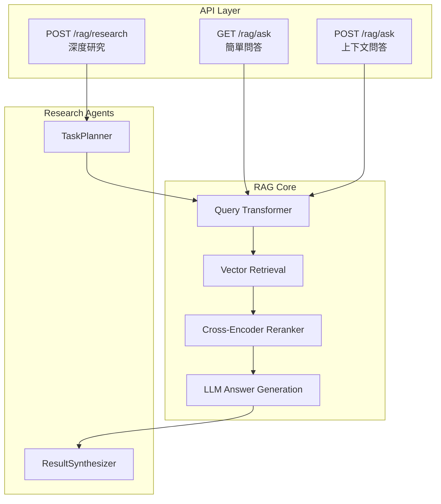
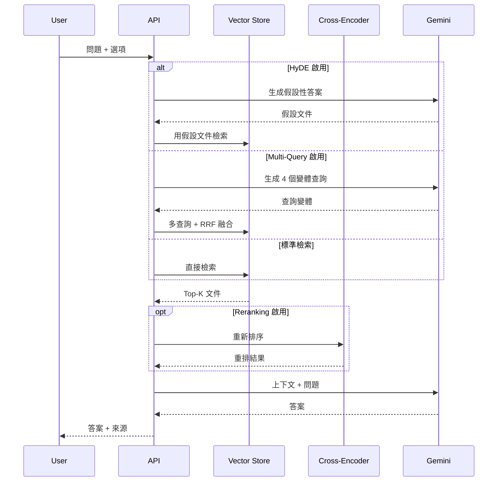
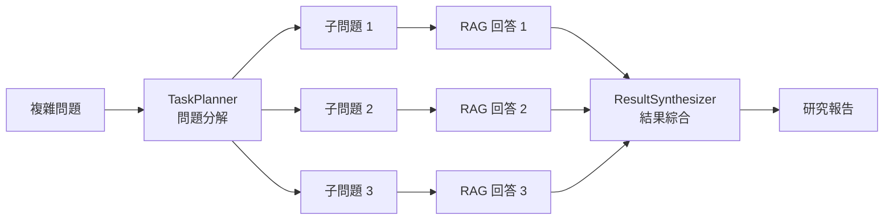

# RAG 問答與深度研究機制 - 技術文件

本文件詳細說明系統的 RAG 問答架構與深度研究模式的運作機制。

---

## 系統架構總覽



---

## 模式一：一般問答 (General Q&A)

### 端點

| Method | Path       | 用途                 |
| ------ | ---------- | -------------------- |
| GET    | `/rag/ask` | 快速問答（無歷史）   |
| POST   | `/rag/ask` | 上下文問答（有歷史） |

### 處理流程



### 核心參數

| 參數                 | 類型              | 預設  | 說明                 |
| -------------------- | ----------------- | ----- | -------------------- |
| `question`           | string            | 必填  | 使用者問題           |
| `doc_ids`            | List[str]         | null  | 限制查詢範圍         |
| `history`            | List[ChatMessage] | null  | 對話歷史 (POST only) |
| `enable_reranking`   | bool              | true  | Cross-Encoder 重排   |
| `enable_hyde`        | bool              | false | HyDE 查詢轉換        |
| `enable_multi_query` | bool              | false | 多查詢 RRF 融合      |

---

## 進階檢索策略

### 1. HyDE (Hypothetical Document Embeddings)

**原理**: 先讓 LLM 生成「假設性答案」，再用這個答案做向量檢索。

**優點**: 查詢與文件的語義更接近，適合開放式問題。

**實作位置**: `data_base/query_transformer.py::transform_query_with_hyde()`

```python
# Prompt
「請針對以下問題，假設你已經知道答案，寫出一段
 包含這個答案的簡短段落（50-100字）」
```

---

### 2. Multi-Query + RRF Fusion

**原理**: 將原始查詢改寫成多個變體，分別檢索後用 Reciprocal Rank Fusion 合併。

**優點**: 捕捉問題的不同面向，減少語義遺漏。

**實作位置**: `data_base/query_transformer.py::transform_query_multi()`

```python
# 融合公式
RRF_score(d) = Σ 1/(k + rank_i(d))  # k=60
```

---

### 3. Cross-Encoder Reranking

**原理**: 用 Cross-Encoder 模型對「問題-文件對」打分，比純向量更精確。

**模型**: `BAAI/bge-reranker-base`

**實作位置**: `data_base/reranker.py::rerank_documents()`

---

## 模式二：深度研究 (Deep Research)

### 端點

```
POST /rag/research
```

### Plan-and-Solve 架構



### 階段說明

#### 階段 1: 問題分解 (TaskPlanner)

**檔案**: `agents/planner.py`

**功能**: 將複雜問題拆解為 2-5 個可獨立回答的子問題。

**Prompt**:

```
你是一個研究規劃專家。請將以下複雜問題分解為 2-5 個可獨立回答的子問題。

要求：
1. 每個子問題應該是具體、可回答的
2. 子問題應涵蓋原問題的不同面向
3. 如果某個子問題依賴另一個的答案，請標註
```

**複雜度判斷啟發式**:

- 問題長度 > 100 字
- 包含「比較」「分析」「評估」等關鍵詞
- 包含 "and", "as well as" 等連接詞

---

#### 階段 2: 子問題執行

每個子問題獨立執行標準 RAG 流程：

1. 向量檢索
2. Reranking (如啟用)
3. LLM 回答

---

#### 階段 3: 結果綜合 (ResultSynthesizer)

**檔案**: `agents/synthesizer.py`

**功能**: 將多個子回答整合為連貫的研究報告。

**Prompt**:

```
你是一個研究報告撰寫專家。請根據以下子問題的回答，綜合生成一份完整的研究報告。

要求：
1. 先提供簡潔摘要（100字內）
2. 然後提供完整的綜合回答
3. 如果各子回答有矛盾，請說明並嘗試調和
4. 使用繁體中文
5. 保持學術嚴謹的語氣
```

**輸出格式**:

```
## 摘要
[摘要內容]

## 詳細分析
[完整綜合回答]
```

---

## 回應結構

### 一般問答回應

```json
{
  "question": "什麼是機器學習?",
  "answer": "機器學習是...",
  "sources": ["doc-uuid-1", "doc-uuid-2"]
}
```

### 深度研究回應

```json
{
  "question": "比較深度學習和傳統機器學習",
  "summary": "深度學習在處理非結構化資料...",
  "detailed_answer": "## 詳細分析\n...",
  "sub_tasks": [
    {
      "id": 1,
      "question": "深度學習的優點是什麼?",
      "answer": "...",
      "sources": ["doc-1"]
    },
    {
      "id": 2,
      "question": "傳統機器學習的優點是什麼?",
      "answer": "...",
      "sources": ["doc-2"]
    }
  ],
  "all_sources": ["doc-1", "doc-2", "doc-3"],
  "confidence": 0.85
}
```

---

## 關鍵檔案索引

| 檔案                                | 功能               |
| ----------------------------------- | ------------------ |
| `data_base/router.py`               | RAG API 端點定義   |
| `data_base/RAG_QA_service.py`       | 核心 RAG 問答邏輯  |
| `data_base/query_transformer.py`    | HyDE + Multi-Query |
| `data_base/reranker.py`             | Cross-Encoder 重排 |
| `data_base/vector_store_manager.py` | FAISS 向量庫管理   |
| `agents/planner.py`                 | 問題分解 Agent     |
| `agents/synthesizer.py`             | 結果綜合 Agent     |
| `core/llm_factory.py`               | LLM 實例管理       |

---

## 效能考量

| 模式                | 預估時間 | LLM 呼叫次數                 |
| ------------------- | -------- | ---------------------------- |
| 簡單問答            | 2-5 秒   | 1                            |
| 問答 + HyDE         | 4-8 秒   | 2                            |
| 問答 + Multi-Query  | 5-10 秒  | 2                            |
| 深度研究 (3 子問題) | 15-30 秒 | 5 (1 規劃 + 3 回答 + 1 綜合) |
