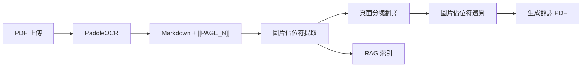
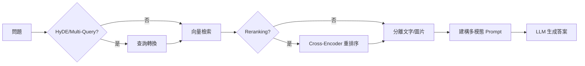

# Multimodal RAG System - 專案完整文件

> 供下一個 AI Agent 參考的專案詳細資訊

---

## 📌 專案概述

| 項目 | 說明 |
|------|------|
| **名稱** | Multimodal RAG System |
| **目的** | PDF 文件 OCR、翻譯、知識庫問答 |
| **框架** | FastAPI + LangChain |
| **部署** | 本地 GPU 伺服器 |

---

## 🛠️ 技術棧

| 類別 | 技術 |
|------|------|
| **後端框架** | FastAPI + Uvicorn |
| **OCR 引擎** | PaddleOCR PPStructureV3 (GPU) |
| **LLM** | Google Gemini API (gemini-2.5-flash, gemma-3-27b-it) |
| **向量嵌入** | BAAI/bge-m3 (HuggingFace) |
| **向量資料庫** | FAISS |
| **重排序** | BGE-Reranker-v2-M3 (可選) |
| **資料庫** | Supabase (PostgreSQL + Auth) |
| **PDF 生成** | markdown-pdf |

---

## 📁 目錄結構

```
d:\flutterserver\pdftopng\
├── main.py                     # FastAPI 應用入口
├── config.env                  # 環境變數配置
├── requirements.txt            # Python 依賴
│
├── core/                       # 核心模組
│   ├── auth.py                 # Supabase JWT 認證
│   ├── llm_factory.py          # LLM 工廠 (雙模型配置)
│   └── supabase_client.py      # Supabase 客戶端
│
├── pdfserviceMD/               # PDF OCR + 翻譯服務
│   ├── router.py               # API 路由 (/pdfmd/*)
│   ├── PDF_OCR_services.py     # PaddleOCR 封裝
│   ├── ai_translate_md.py      # 翻譯入口
│   ├── translation_chunker.py  # 頁面分塊翻譯
│   ├── markdown_to_pdf.py      # Markdown → PDF
│   └── markdown_process.py     # 圖片佔位符處理
│
├── data_base/                  # RAG 核心服務
│   ├── router.py               # API 路由 (/rag/*)
│   ├── RAG_QA_service.py       # 問答服務
│   ├── vector_store_manager.py # FAISS 向量庫
│   ├── word_chunk_strategy.py  # 分塊策略
│   ├── semantic_chunker.py     # 語義分塊
│   ├── reranker.py             # Cross-Encoder 重排序
│   ├── query_transformer.py    # HyDE/Multi-Query
│   ├── context_enricher.py     # 上下文增強
│   ├── proposition_chunker.py  # 命題分塊
│   └── parent_child_store.py   # 父子文件存儲
│
├── agents/                     # AI Agent 模組
│   ├── evaluator.py            # Self-RAG 評估器
│   ├── planner.py              # 任務規劃器
│   └── synthesizer.py          # 結果合成器
│
├── multimodal_rag/             # 多模態處理
│   ├── structure_analyzer.py   # 文檔結構分析
│   ├── image_summarizer.py     # 圖片摘要生成
│   └── schemas.py              # 資料模型
│
├── image_service/              # 獨立圖片翻譯
│   └── router.py               # API 路由 (/imagemd/*)
│
└── tests/                      # 測試套件 (104 tests)
    ├── test_evaluator.py
    ├── test_planner.py
    ├── test_semantic_chunker.py
    └── ...
```

---

## 🔌 API 端點

### PDF OCR + 翻譯 (`/pdfmd`)

| 端點 | 方法 | 說明 |
|------|------|------|
| `/pdfmd/ocr` | POST | 上傳 PDF → OCR → 翻譯 → 返回 PDF |
| `/pdfmd/files` | GET | 列出用戶所有文件 |
| `/pdfmd/files/{doc_id}` | DELETE | 刪除指定文件 |

**POST /pdfmd/ocr:**
```python
# Request: multipart/form-data
file: UploadFile  # PDF 檔案

# Response: application/pdf
# 返回翻譯後的 PDF 二進制檔案
```

---

### RAG 問答 (`/rag`)

| 端點 | 方法 | 說明 |
|------|------|------|
| `/rag/ask` | GET | 基本問答 |
| `/rag/research` | POST | 深度研究 (Plan-and-Solve) |

**GET /rag/ask:**
```python
# Query Parameters
question: str                    # 問題
doc_ids: Optional[List[str]]     # 限定文件 ID
enable_reranking: bool = True    # 啟用重排序
enable_hyde: bool = False        # 啟用 HyDE
enable_multi_query: bool = False # 啟用多查詢

# Response
{
    "question": str,
    "answer": str,
    "sources": List[str]  # 引用的文件 ID
}
```

**POST /rag/research:**
```python
# Request Body
{
    "question": str,
    "max_subtasks": int = 5
}

# Response
{
    "question": str,
    "summary": str,           # 摘要
    "detailed_answer": str,   # 詳細答案
    "sub_tasks": List[...],   # 子任務結果
    "all_sources": List[str],
    "confidence": float
}
```

---

## 🤖 LLM 配置

### 模型分配

| 用途 | 模型 | Input Limit | Output Limit |
|------|------|-------------|--------------|
| **translation** | `gemini-2.5-flash` | 1,048,576 | 65,536 |
| **其他所有** | `gemma-3-27b-it` | 131,072 | 8,192 |

### LLM 用途類型

```python
LLMPurpose = Literal[
    "rag_qa",              # 問答
    "translation",         # 翻譯 (使用 flash)
    "image_caption",       # 圖片描述
    "context_generation",  # 上下文生成
    "proposition_extraction",
    "query_rewrite",       # HyDE/Multi-Query
    "evaluator",           # Self-RAG 評估
    "planner",             # 任務規劃
    "synthesizer"          # 結果合成
]
```

### 使用方式

```python
from core.llm_factory import get_llm

llm = get_llm("translation")  # → gemini-2.5-flash
llm = get_llm("rag_qa")       # → gemma-3-27b-it
```

---

## 📊 資料流

### PDF 處理流程



### RAG 問答流程



---

## 🔐 認證機制

### Supabase JWT

```python
# core/auth.py
async def get_current_user_id(
    authorization: str = Header(...)
) -> str:
    # 1. 解析 Bearer token
    # 2. Supabase 驗證 JWT
    # 3. 返回 user_id
```

### 開發模式

```env
# config.env
DEV_MODE=true  # 跳過認證，使用測試用戶
```

---

## 🧪 測試

### 執行測試

```powershell
cd d:\flutterserver\pdftopng
pytest tests/ -v
```

### 測試覆蓋

| 模組 | 測試檔案 |
|------|----------|
| Self-RAG | [test_evaluator.py](file:///d:/flutterserver/pdftopng/tests/test_evaluator.py) |
| 任務規劃 | [test_planner.py](file:///d:/flutterserver/pdftopng/tests/test_planner.py) |
| 結果合成 | [test_synthesizer.py](file:///d:/flutterserver/pdftopng/tests/test_synthesizer.py) |
| 語義分塊 | [test_semantic_chunker.py](file:///d:/flutterserver/pdftopng/tests/test_semantic_chunker.py) |
| 查詢轉換 | [test_query_transformer.py](file:///d:/flutterserver/pdftopng/tests/test_query_transformer.py) |
| 重排序 | [test_reranker.py](file:///d:/flutterserver/pdftopng/tests/test_reranker.py) |

---

## 🚀 啟動專案

```powershell
cd d:\flutterserver\pdftopng

# 設定環境變數
# 確保 config.env 包含:
# - GOOGLE_API_KEY
# - HF_TOKEN
# - SUPABASE_URL
# - SUPABASE_KEY

# 啟動
uvicorn main:app --reload --port 8000
```

---

## 📈 開發路線圖

| Phase | 功能 | 狀態 |
|-------|------|------|
| 1-3 | 基礎 RAG + Agents | ✅ 完成 |
| 4.1 | LLM 雙模型配置 | ✅ 完成 |
| 4.2 | 翻譯頁面分塊 | ✅ 完成 |
| 4.3 | 交錯式多模態問答 | ✅ 完成 |
| 5 | GraphRAG (跨文件推理) | 📝 待實作 |
| 6 | ColPali (視覺嵌入) | 📝 待實作 |

---

## ⚠️ 已知問題

1. **GPU 資源衝突**: PaddleOCR 與 PyTorch 共用 GPU 時，需處理裝置存取錯誤
2. **Reranker 可選**: 需額外 ~2GB VRAM，不載入時自動跳過
3. **DEV_MODE UUID**: 測試用戶 ID 需為有效 UUID 格式才能寫入 Supabase
